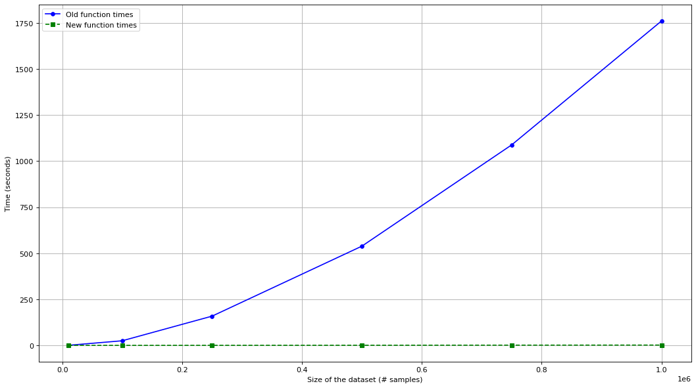

# Benchmarking fklearn's space_time_split_dataset function

[Open notebook](./benchmark_space_time_split_dataset.ipynb)

## Motivation

Issue: [https://github.com/nubank/fklearn/issues/137](https://github.com/nubank/fklearn/issues/137)

Pull request: [https://github.com/nubank/fklearn/pull/138](https://github.com/nubank/fklearn/pull/138)

## How to run

```bash
conda create --name benchmark_fklearn python=3.7.7

conda activate benchmark_fklearn
```

```bash
pip install requirements.txt
```

```bash
jupyter lab
```


